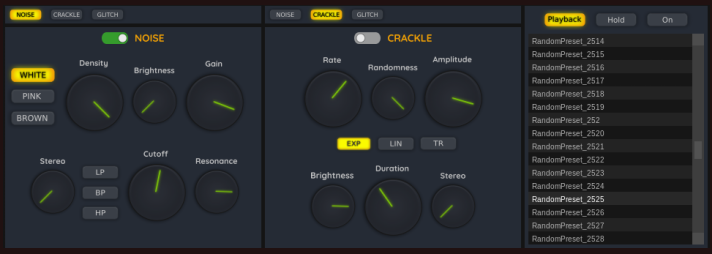

# Entropictron

**Entropictron** is a [free software](https://www.gnu.org/philosophy/free-sw.en.html)
context synthesizer and audio effect.

**Website:** [https://quamplex.com/entropictron](https://quamplex.com/entropictron)

Entropictron can produce a variety of sound textures that can
serve as background or contextual elements in music tracks.
Useful for ambient music, sound effects, film and
video production, game audio, and other.

**License:** GNU General Public License, Version 3

**Version:** 1.0.0 (not released yet)

## Features

Entropictron combines and mixes several sound generators and effects,
allowing to layer Noise, Crackle, and Glitch in a single patch.

### Noise (×2)
A noise generator producing various noise types with an integrated
filter to shape the frequency spectrum.

**Parameters:**
- Type (white, pink, brownian)
- Density
- Brightness
- Gain
- Stereo
- Filter type (low-pass, band-pass, high-pass)
- Filter cutoff
- Filter resonance

### Crackle (×2)
Generates short, irregular bursts with different shapes.

**Parameters:**
- Rate
- Randomness
- Amplitude
- Burst shape (exponential, linear, triangle)
- Brightness
- Duration
- Stereo spread

### Glitch (×2)
Simulates memory-based glitches with adjustable length, randomness,
and jump parameters, creating stutters and digital artifacts.

**Parameters:**
- Repeats
- Probability
- Length
- Minimum jump
- Maximum jump

