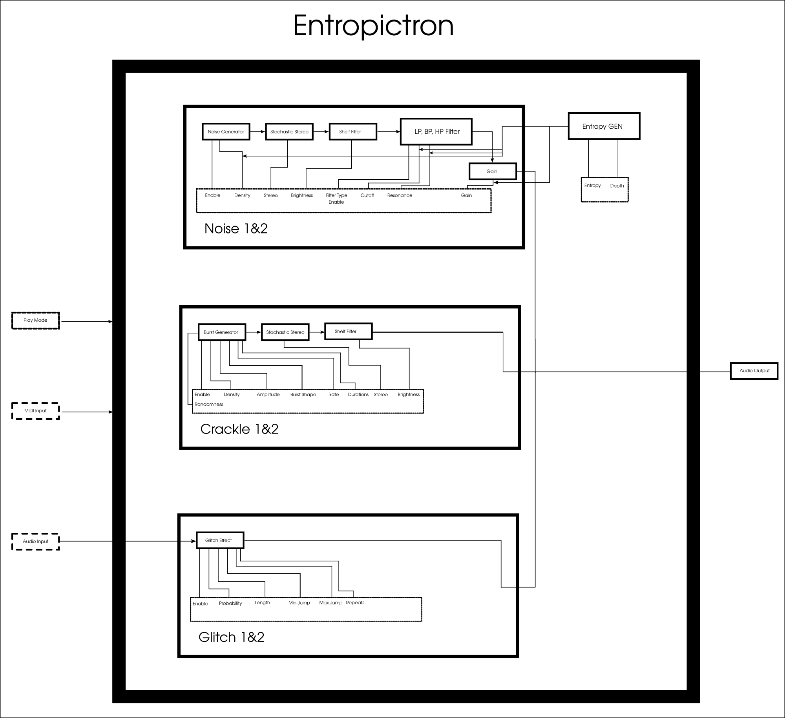

## Table of Contents

[What is Entropictron](#what-is-entropictron)
[Block Diagram](#block-diagram)
[Noise](#noise)
[Crackle](#crackle)
[Glitch](#glitch)
[Factory Presets](#factroy-presets)
[Play Mode](#play-mode)
[Global Entropy](#global-entropy)
[Audio Plugin](#audio-plugin)
[Build & Install](#build--install)

# Entropictron User Guide

**Author:** Quamplex (Iurie Nistor)

**License:** This work (including all images it uses) is released under [CC0 1.0 Universal (CC0 1.0) Public Domain Dedication](https://creativecommons.org/publicdomain/zero/1.0/deed.en).

**Version:** 1.1.0

**Website:** [https://quamplex.com/entropictron](https://quamplex.com/entropictron)

### What is Entropictron

Entropictron is a [free software](https://www.gnu.org/philosophy/free-sw.en.html)
context synthesizer and audio effect. Entropictron can produce a variety of sound
textures that can serve as background or contextual elements in music tracks.
Useful for ambient music, sound effects, film and video production, game audio,
and other. Entropictron is released under the GNU General Public License version 3 (and later),
developed in C and C++, and utilizes the CMake build system. It can be used as an VST3 audio plugin.
Can run on GNU/Linux and Windows.

The name **Entropictron** derives from the root word *entropy*, which generally refers to something chaotic.

### Block diagram

Entropictron consists of three primary modules: a noise generator, a crackle generator, and a glitch effect.
Each module can be tuned via its own set of parameters, and the processed
signals are finally mixed to produce the output sound. Here is the block diagram that
shows the general overview of the parts of Entropictron.

### Noise

The Noise generator can generate three types of noise: white, pink, and brownian.
This generator has the following parameter controls:

- **Noise type buttons (White, Pink, Brown):** Selects the type of noise to generate.
- **Density knob:** Controls the density of the noise. Maximum density generates a new noise value at every sample.
- **Brightness knob:** Adjusts the brightness of the noise.
- **Gain:** Controls the output gain, ranging from -50 dB to +6 dB.
- **Stereo:** Adjusts the stereo spread. This is not a usual stereo effect,
              but a stochastic one. For white and pink noise, 100% stereo creates a spatial
              effect that can simulate room reverb. Brownian noise behaves differently
              and does not create a true stereo effect.
- **LP, BP, HP buttons:** Low-pass (LP), band-pass (BP), and high-pass (HP) filters.
              Pressing the active button again will turn off
              the filter. By default, filters are turned off.
- **Cutoff knob:** Sets the cutoff frequency of the filter, ranging from 20 Hz to 18,000 Hz.
- **Resonance knob:** Controls the resonance of the filter.

### Crackle

The Crackle produces random bursts of three types: exponential, linear, and triangle.
It has the following parameters:

- **Rate knob:** Controls the maximum number of random bursts per second. Ranges from 0.5 Hz to 150 Hz.
- **Randomness knob:** Controls how random the burst amplitudes and timing are. Ranges from 1% to 100%.
- **Amplitude knob:** Controls the possible maximum amplitude of the generated bursts. Ranges from -50 dB to +6 dB.
- **Duration knob:** Controls the duration of each burst. Ranges from 0.1 ms to 50 ms.
- **Stereo knob:** Creates a stochastic stereo effect, where bursts are spread randomly across both channels.
- **EXP, LIN, TR buttons:** Select the burst shape - exponential decay (EXP), linear decay (LIN), or triangle (TR).

### Glitch

The Glitch effect simulates memory glitch effects. It takes the audio input,
processes it to create glitches, and outputs the result.
During playback, the audio occasionally jumps back and
replays parts of the signal (as glitches), mixing them with the current audio.

It has the following parameters:

- **Repeats knob:** Number of repeated glitches. Ranges from 1 to 6.
- **Probability knob:** Controls the randomness of glitch occurrences.
- **Length knob:** Controls the length of each glitch, i.e., how much of the audio is repeated during playback.
- **Min Jump knob:** Minimum jump back in milliseconds, determining where the glitch starts. Ranges from 0 to 100 ms.
- **Max Jump knob:** Maximum jump back in milliseconds, determining where the glitch starts. Ranges from 100 ms to 1000 ms.

### Factory Presets

Factory presets are JSON-format files with the extension `*.entp`.
They are installed in the corresponding user directory depending on the platform.
The plugin UI loads these files and displays the list of available presets.

### Play Mode

The UI provides three buttons to select the play mode:

- **Playback** – The audio plugin processes or generates audio only when the host is playing.
- **Hold** – The audio plugin processes or generates audio only while a MIDI key is held.
- **On** – The audio plugin always processes or generates audio.

By default, the plugin is loaded in **Playback** mode. The selected mode is saved in the plugin state.

### Global Entropy

Global Entropy is a global random LFO (walker) that generates a value that changes over time.
This entropy value modulates the **density**, **gain**, and **filter cutoff and resonance** of the Noise module.

The entropy is controlled by two parameters:

- **Entropy** – sets the rate at which the entropy value changes.
- **Depth** – sets the amount (depth) of the entropy modulation.

The UI contains knobs to control these two parameters.

There is also an entropy value graph that shows the current entropy value in real time.

### Audio Plugin

Entropictron is available as an audio plugin in VST3 format. Therefore, it is necessary
to use a host that supports this format.

### Build & Install

For instructions on building and installing Entropictron, please refer to the README file.
